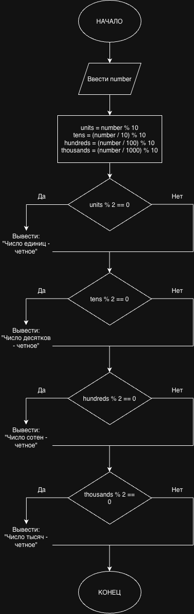

# Лабораторная работа

## Вариант 9

### Условие задачи

Дано четырехзначное число. Необходимо определить четные разряды числа. Программа должна выводить диагностическое сообщение о том, какой разряд является четным.

## Алгоритм

1. Ввести четырехзначное число.
2. Определить цифру единиц.
3. Определить цифру десятков.
4. Определить цифру сотен.
5. Определить цифру тысяч.
6. Проверить каждую цифру на четность.
7. Для каждого четного разряда вывести соответствующее сообщение.

## Выделение разрядов

Цифра единиц:

```c
units = number % 10;
```

Цифра десятков:

```c
tens = (number / 10) % 10;
```

Цифра сотен:

```c
hundreds = (number / 100) % 10;
```

Цифра тысяч:

```c
thousands = (number / 1000) % 10;
```

Для проверки четности используется условие:

```c
digit % 2 == 0
```

## Блок-схема



## Код программы

```c
#include <stdio.h>

int main()
{
    int number;
    int units, tens, hundreds, thousands;

    printf("Введите четырехзначное число: ");
    scanf("%d", &number);

    units = number % 10;
    tens = (number / 10) % 10;
    hundreds = (number / 100) % 10;
    thousands = (number / 1000) % 10;

    if (units % 2 == 0)
    {
        printf("Число единиц - четное\n");
    }

    if (tens % 2 == 0)
    {
        printf("Число десятков - четное\n");
    }

    if (hundreds % 2 == 0)
    {
        printf("Число сотен - четное\n");
    }

    if (thousands % 2 == 0)
    {
        printf("Число тысяч - четное\n");
    }

    return 0;
}
```

## Проверка программы

### Пример 1

Входные данные:

```text
2486
```

Результат:

```text
Число единиц - четное
Число десятков - четное
Число сотен - четное
Число тысяч - четное
```

### Пример 2

Входные данные:

```text
1358
```

Результат:

```text
Число единиц - четное
```

## Вывод

В ходе выполнения работы была разработана программа на языке C для определения четных разрядов четырехзначного числа. Для выделения отдельных цифр использовались операции целочисленного деления и получения остатка от деления. Проверка четности выполнялась с помощью оператора `%` и условного оператора `if`.

## Разработчик

Каверин Максим, группа БИЦТ-262
